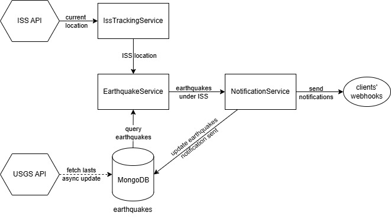

<h3> Description </h3>

This project is a solution to <i> FullInfo </i> technical assignment. It consists of an API that notifies client webhooks whenever the ISS is over an earthquake.

The API, built with TypeScript and Express.js, utilizes a background process that runs continuously on a loop. During each iteration, the background process checks the current location of the International Space Station (ISS) and the locations of recent earthquakes.
When the ISS's location overlaps with that of an earthquake, a notification is sent to all registered client webhook URLs.

This allows client applications to receive real-time alerts about potential correlations between space activity and seismic events

*Diagram illustrating the notification process.*

Earthquakes are not fetched directly from USGS's API, rather they are queried from a mongo database that's been kept updated with USGS's latest earthquakes.

Once the notifications have been sent, earthquakes are updated to mark that they have already been notified.

<h3> ISS Tracking Service </h3>

This service is a RESTful API client that interacts with the [ISS API](https://api.wheretheiss.at/v1/satellites/25544) to retrieve the ISS's current location. 

To handle potential temporary issues with the ISS API, a retry mechanism is implemented. However, if the ISS API remains unavailable after all retry attempts, the service will not be able to retrieve the ISS location, and the main notification loop will need to handle this scenario.

The retry logic is configured to wait for a specific duration between attempts. After exhausting all configured retry attempts without a successful response from the ISS API, the service will return an undefined result.