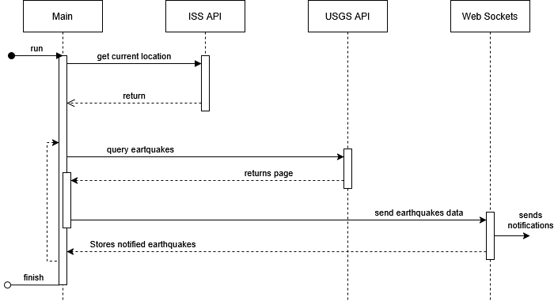

# ISS Over Earthquake Notifier

This project contains a proof-of-concept script (`poc.js`) that checks if the International Space Station (ISS) is currently flying over recent earthquake locations. The script fetches data from external APIs to determine the ISS's position and recent earthquake events.

## Requirements

- Node.js (v14 or higher)
- npm (Node Package Manager)

## Installation

1. Clone the repository:
    ```bash
    git clone git@github.com:maximiliano-plano/iss_over_earthquake_notifier.git
    cd iss_over_earthquake_notifier
    ```

2. Install dependencies:
    ```bash
    npm install
    ```

## How `poc.js` Works



1. Fetches the current position of the ISS using a public API.
2. Retrieves a page of earthquakes from a radius around ISS location.
3. Determines if notifications have already been sent for found earthquakes.
4. Sends notifications to connected clients through a web socket.
5. Stores earthquakes notified to avoid sending repeated notifications.
6. Checks if there are additional pages of earthquake data to fetch. If so, starts from 2.
7. Once all earthquake notifications are sent, the script terminates.

## Running the Main Script

To execute the main method in `poc.js`, enter node REPL and import it:

```bash
node 
const {main} = require('./poc');
```

Once imported a Web socket server is started at port 8080. 

To check if the ISS is over an earthquake, call `main` with the following parameters:
1. `minmagnitude`: The minimum magnitude (on the Richter scale) to consider an earthquake.
2. `age`: The maximum age of an earthquake in years to be considered.
3. `radius`: The radius (in kilometers) measured from the earthquake's epicenter within which the ISS is considered to be "over" the earthquake.

```js
main(4, 1, 10);
```

Example output:
```
ISS is over an earthquake at 61 km SSE of Pangai, Tonga
ISS is over an earthquake at 2025 Mandalay, Burma (Myanmar) Earthquake
ISS is over an earthquake at 208 km SSW of George Town, Cayman Islands
ISS is over an earthquake at 2025 Southern Tibetan Plateau Earthquake
ISS is over an earthquake at 24 km WNW of Port-Vila, Vanuatu
ISS is over an earthquake at 2024 Offshore Cape Mendocino, California Earthquake
ISS is over an earthquake at 102 km E of Petropavlovsk-Kamchatsky, Russia
ISS is over an earthquake at 2024 Hyuganada Sea, Japan Earthquake
ISS is over an earthquake at 41 km ESE of San Pedro de Atacama, Chile
ISS is over an earthquake at 106 km WSW of Sangay, Philippines
ISS is over an earthquake at 10 km WSW of Atiquipa, Peru
No more earthquakes to notify
```
In the above example, the radius was set to almost the entire circumference of the planet to ensure results. For realistic use cases, consider setting the `radius` to a smaller value (e.g., 500 km for regional coverage), `minmagnitude` to a threshold relevant to your interest (e.g., 5 for moderate earthquakes), and `age` to a reasonable time frame (e.g., 1 for earthquakes in the last year). Adjust these parameters based on your specific requirements.

## Running Tests

This project includes tests to ensure the functionality of the script. To run the tests, use:

```bash
npm test
```

Example output:
```
PASS  ./tests/poc.test.js
✓ Fetches ISS position correctly (50ms)
✓ Fetches earthquake data correctly (30ms)
✓ Matches ISS position with earthquake zones (40ms)
```

## Notes

- Ensure you have an active internet connection as the script relies on external APIs.
- API rate limits may apply depending on usage.

Feel free to contribute or report issues in the repository!  